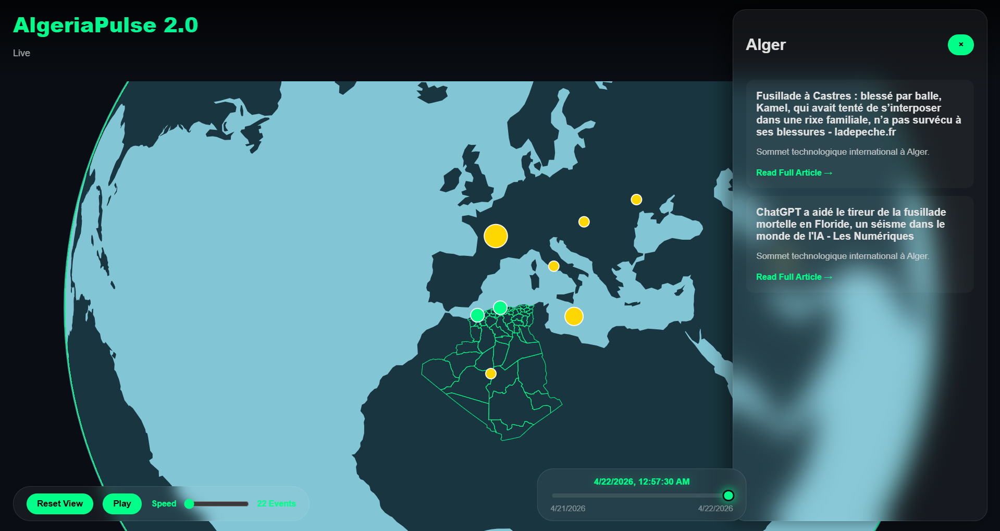

# AlgeriaPulse 2.0 - Interactive 3D News Globe

AlgeriaPulse 2.0 is a state-of-the-art geospatial visualization platform that monitors and maps news across Algeria and the world in real-time. Using AI-powered extraction and a dynamic 3D globe, it provides an intuitive way to explore the regional impact of current events.

 *(Note: Replace with actual screenshot)*

## 🌟 Features

- **Interactive 3D Globe**: Built with D3.js and TopoJSON, offering smooth rotation, zooming, and geospatial projection.
- **AI News Extraction**: Utilizes Google Gemini AI to analyze raw RSS headlines, extract locations (Wilayas), and categorize events.
- **Multi-Source Aggregation**: Fetches data from diverse sources including Google News, TSA Algérie, APS (Algeria Press Service), and more.
- **History Preservation**: Automatically saves processed news to a local `history.json` database to avoid redundant AI processing and build a long-term archive.
- **News Timeline**: A sleek, glassmorphic timeline slider that allows users to scrub through history and visualize the progression of events.
- **Responsive Design**: Premium dark-mode interface with mobile-friendly adjustments.

## 🚀 Getting Started

### Prerequisites
- Python 3.8+
- Node.js (Optional, for advanced dev tools)
- A Google Gemini API Key

### Installation

1. **Clone the repository:**
   ```bash
   git clone https://github.com/AladinAzz/News-World-Map.git
   cd News-World-Map
   ```

2. **Setup Backend:**
   ```bash
   cd backend
   python -m venv venv
   source venv/bin/activate  # On Windows: venv\Scripts\activate
   pip install -r requirements.txt
   ```

3. **Configure Environment:**
   Create a `.env` file in the root directory and add your Gemini API key:
   ```env
   GOOGLE_API_KEY=your_api_key_here
   ```

### Running the Application

For Windows users, simply run the automation script:
```bash
.\start_app.bat
```
This will:
1. Start the Flask backend on `http://localhost:5000`.
2. Start a local frontend server on `http://localhost:8000`.
3. Open your default browser to the application.

## 🛠️ Tech Stack

- **Frontend**: Vanilla Javascript, CSS3 (Custom Design System), D3.js (Geospatial Rendering), TopoJSON.
- **Backend**: Python, Flask, Feedparser (RSS Ingestion).
- **AI/ML**: Google Generative AI (Gemini Flash) for NLP tasks.
- **Data**: JSON-based local storage for geospatial coordinates and event history.

## 📁 Project Structure

```text
├── backend/
│   ├── app.py              # Flask Entry Point
│   ├── services/           # RSS, Gemini, and Normalization logic
│   ├── data/               # Wilayas and History storage
│   └── venv/               # Virtual Environment
├── frontend/
│   ├── index.html          # Main UI
│   ├── style.css           # Premium styling
│   ├── main.js             # Application logic
│   ├── rendering/          # Globe rendering components
│   └── state.js            # Frontend state management
└── start_app.bat           # Automation script
```

## 📄 License
This project is licensed under the MIT License - see the LICENSE file for details.

---
*Created with ❤️ for data visualization and journalism in Algeria.*
