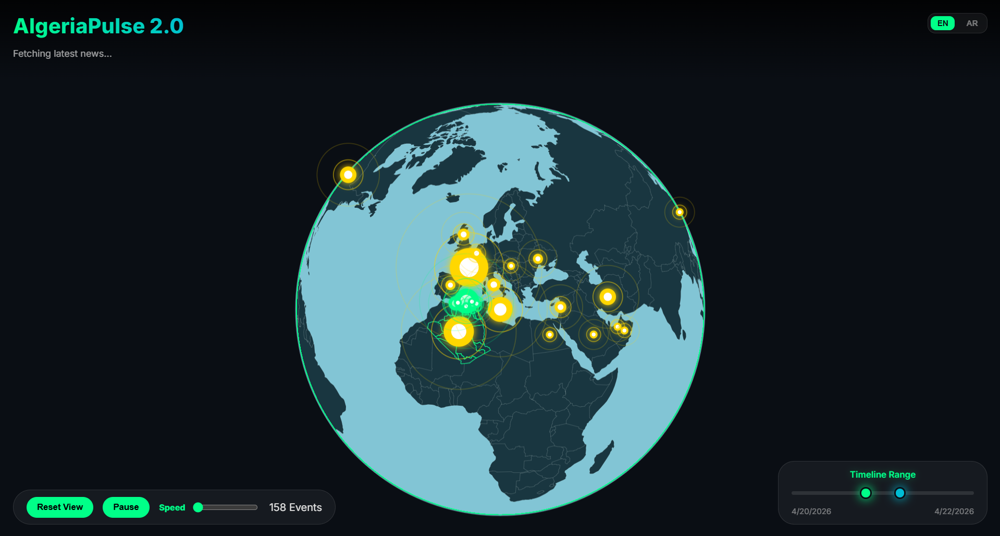
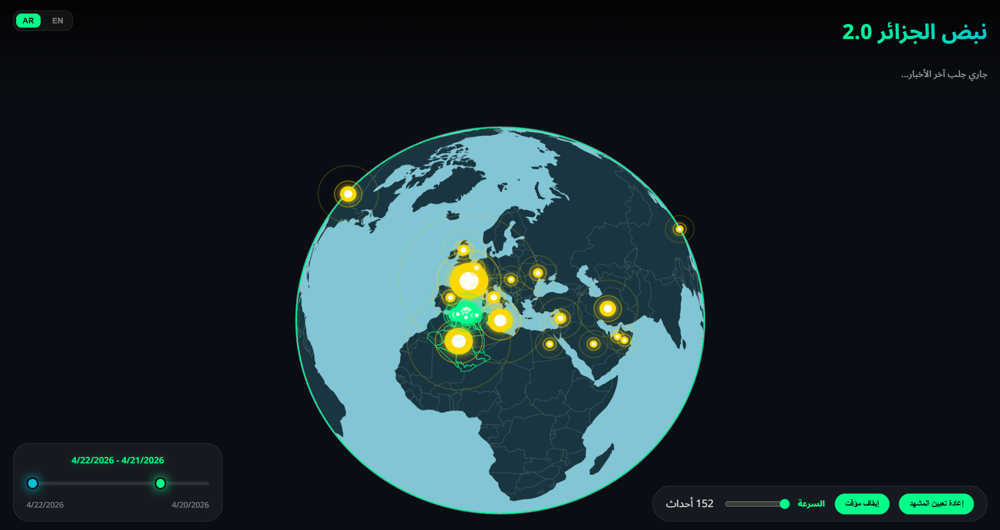
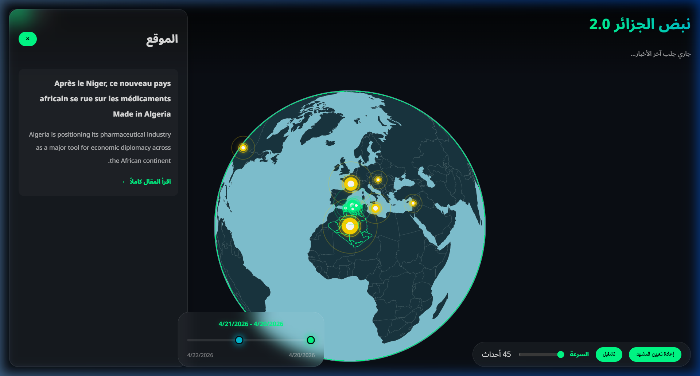
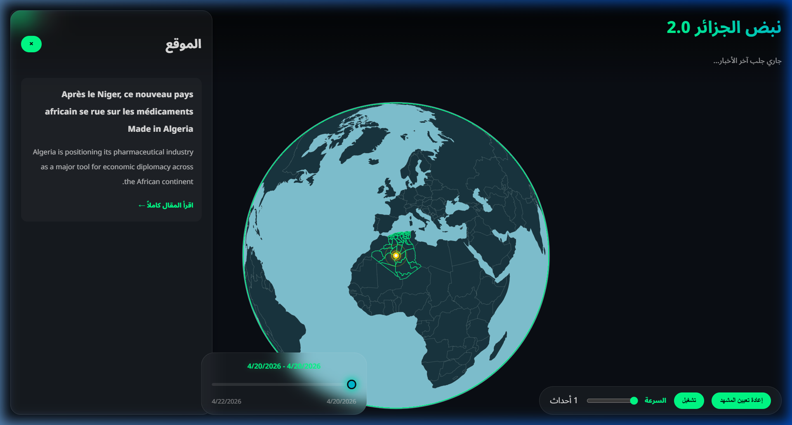

# 🌍 AlgeriaPulse 2.0: The Future of News Visualization

[](https://opensource.org/licenses/MIT)
[](https://www.python.org/downloads/)
[](https://d3js.org/)
[](https://deepmind.google/technologies/gemini/)

AlgeriaPulse 2.0 is a cutting-edge geospatial intelligence platform designed to bridge the gap between abstract news data and intuitive spatial understanding. By transforming raw RSS feeds into an interactive 3D environment, the platform allows users to visualize the pulse of current events across Algeria's 58 wilayas and the global stage in real-time.

---

## 📸 Visual Overview

The interface is built with a "Glassmorphic Design Language," prioritizing depth, transparency, and vibrant micro-animations.

| **Global Perspective (English)** | **Arabic Support & RTL Layout** |
|:---:|:---:|
|  |  |
| *High-fidelity English interface featuring global news pulses.* | *Native Arabic experience with full Right-to-Left (RTL) mirroring.* |

| **Advanced Timeline Filtering** | **Detailed News Insights** |
|:---:|:---:|
|  |  |
| *Precision temporal scrubbing using a dual-handle range slider.* | *Deep-dive panel with AI-summarized bilingual content.* |

---

## 🌟 Core Pillars

### 1. High-Performance Geospatial Rendering
At its core, AlgeriaPulse 2.0 utilizes a custom-built rendering engine based on **D3.js** and **HTML5 Canvas**. Unlike SVG-based maps that struggle with thousands of elements, our Canvas implementation ensures 60FPS performance even during heavy data synchronization. It supports both **TopoJSON** and **GeoJSON** formats, providing high-resolution boundaries for Algeria and the world.

### 2. AI-Driven Intelligence Layer
Raw news is messy. Our backend leverages **Google Gemini 1.5 Flash** to perform real-time Natural Language Processing (NLP). The AI doesn't just read the news; it:
- **Geocodes**: Identifies specific cities and wilayas.
- **Categorizes**: Determines the scope (local, national, international).
- **Summarizes**: Generates concise, 1-sentence summaries in both **English** and **Arabic**.
- **Quantifies**: Assigns intensity scores based on the significance of the event.

### 3. Bilingual Heritage (EN/AR)
Algeria is a land of multiple languages. Our platform honors this by providing a first-class **Arabic experience**. This isn't just translation; it's **localization**. The entire UI flips (RTL), fonts switch to **Noto Sans Arabic**, and the AI pipeline extracts native Arabic summaries directly from the source.

---

## 🏗️ Technical Architecture

### 📁 Directory Structure
```text
project_2.0/
├── backend/                # The Brain (Python/Flask)
│   ├── app.py              # REST API & Server Entry
│   ├── services/           # Business Logic Layer
│   │   ├── rss_service.py  # Multi-source ingestion
│   │   ├── gemini_service.py # AI extraction & translation
│   │   ├── aggregation.py  # Spatial data grouping
│   │   └── history.service.py # Persistence management
│   ├── data/               # Persistent Storage
│   │   ├── history.json    # The long-term archive
│   │   └── countries.json  # Geocoding lookup table
│   └── venv/               # Isolated dependencies
├── frontend/               # The Beauty (JS/Canvas/CSS)
│   ├── index.html          # Semantic HTML5 & UI Layout
│   ├── main.js             # State orchestrator & Event bus
│   ├── style.css           # Custom Design System (Glassmorphism)
│   ├── rendering/          # D3 logic & Animation loops
│   │   └── globe.js        # The 3D Rendering Engine
│   └── utils/              # Helper utilities
│       ├── i18n.js         # Translation & RTL engine
│       └── geo.js          # Geodata fetcher
└── start_app.bat           # Cross-platform automation script
```

### 🧠 Backend: The Data Pipeline
The backend operates on a multi-stage pipeline:
1. **Ingestion**: `Feedparser` scans a curated list of RSS sources (TSA, APS, Google News Algeria).
2. **Filtering**: The system deduplicates articles based on URL and title hashing.
3. **AI Extraction**: Gemini Flash processes batches of news to generate structured JSON.
4. **Normalization**: The `NormalizationService` maps extracted location names (e.g., "Constantine") to specific [lat, lng] coordinates.
5. **Persistence**: New events are merged into `history.json` and served via `/api/history`.

### 🎨 Frontend: The Rendering Pipeline
The `GlobeRenderer` class manages a `d3.timer` loop that performs the following steps every frame:
1. **Projection Update**: Adjusts the `geoOrthographic` rotation based on user drag or auto-rotation.
2. **Sphere Rendering**: Draws the ocean layer with a soft halo.
3. **Landmass Rendering**: Renders GeoJSON features for the world map with a sleek #1A2B3C fill.
4. **Algeria Highlight**: Renders the 58 provinces of Algeria with an accented #00FF88 border.
5. **Pulse Animation**: Calculates the phase of two expanding rings for each event using `performance.now()`, creating a "beating" heart effect on the map.

---

## 🛠️ Advanced Features Deep-Dive

### 📅 The Dual-Handle Timeline
Traditional news apps show you "now." AlgeriaPulse 2.0 shows you "history."
- **Range Selection**: Users can drag the **Start** and **End** handles to view news from a specific week, day, or hour.
- **Dynamic Filtering**: The UI reactively updates as you slide, fading markers in and out as they fall within the selected window.
- **State Synchronization**: The timeline range is preserved in the global `state.js`, ensuring consistency across UI components.

### ⚡ Pulse Animation Physics
Each news marker consists of three layers:
- **Core Dot**: A solid #00FF88 or #FFD700 circle indicating the epicenter.
- **Expanding Ring A**: A ring that expands from 0% to 100% size over 2 seconds, fading as it grows.
- **Expanding Ring B**: An identical ring offset by 1 second, creating a continuous rhythmic pulse.
- **Shadow Glow**: High-intensity events feature a `shadowBlur` effect that illuminates the surrounding globe area.

---

## 🚀 Installation & Developer Guide

### Environment Setup
AlgeriaPulse 2.0 requires Python 3.8+ for the backend services.

1. **Clone & Enter**:
   ```bash
   git clone https://github.com/AladinAzz/News-World-Map.git
   cd News-World-Map
   ```

2. **API Configuration**:
   Create a `.env` file in the root directory:
   ```env
   GOOGLE_API_KEY=your_gemini_api_key_here
   ```

3. **Automation**:
   On Windows, simply double-click `start_app.bat`. This script will:
   - Check for a Virtual Environment (create if missing).
   - Install all required libraries (`flask`, `google-generativeai`, `feedparser`).
   - Launch the Flask server (Port 5000).
   - Launch a lightweight HTTP server for the Frontend (Port 8000).
   - Open your browser to the local application.

### Manual Backend Setup
```bash
cd backend
python -m venv venv
venv\Scripts\activate
pip install -r requirements.txt
python app.py
```

### Manual Frontend Setup
Any static file server will work. For example:
```bash
python -m http.server 8000
```

---

## 📡 API Reference

### `GET /api/history`
Returns the full archive of processed news events.
- **Format**: JSON
- **Response**:
  ```json
  [
    {
      "location": "Algiers",
      "coordinates": [3.0588, 36.7538],
      "events": [
        {
          "title": "...",
          "summary_en": "...",
          "summary_ar": "...",
          "published": "2026-04-22T10:00:00Z"
        }
      ]
    }
  ]
  ```

### `GET /api/events`
Triggers a live scrape of current news sources, processes them via AI, and returns the combined history + live updates.

---

## 📈 Performance Optimization Strategies

### 1. History-First Loading
To avoid the "empty globe" problem during the 10-20 seconds it takes for the AI to scrape and process live news, the frontend loads the `history.json` archive **immediately**. The globe is populated instantly, and live updates are "hot-swapped" once the background sync completes.

### 2. Canvas vs. SVG
By using a single HTML5 Canvas for the globe and all markers, we avoid the overhead of thousands of DOM elements. This allows for smooth interaction even on low-end devices.

### 3. Debounced Interactions
Zooming and dragging triggers projection updates. These are optimized using D3's transition engine to ensure that rotation calculations don't block the UI thread.

---

## 🗺️ Roadmap & Future Work

- [ ] **Real-time WebSockets**: Implement Socket.io for instant event pushing without polling.
- [ ] **Heatmap Overlay**: Add a global intensity heatmap to visualize news "hotspots."
- [ ] **Mobile App Port**: Wrap the D3 engine in Capacitor or React Native for iOS/Android deployment.
- [ ] **Voice Search**: Allow users to say "Show me news in Oran" to automatically rotate the globe.
- [ ] **Advanced Analytics**: Generate weekly AI reports on the most trending news topics in Algeria.

---

## 🤝 Contributing

We welcome contributions! If you'd like to improve the rendering engine, add new news sources, or enhance the AI prompts:
1. Fork the Project.
2. Create your Feature Branch (`git checkout -b feature/AmazingFeature`).
3. Commit your Changes (`git commit -m 'Add some AmazingFeature'`).
4. Push to the Branch (`git push origin feature/AmazingFeature`).
5. Open a Pull Request.

---

## 📄 License
Distributed under the MIT License. See `LICENSE` for more information.

## 👥 Acknowledgments
- **D3.js Community**: For the incredible geospatial math.
- **Google AI**: For the Gemini Flash model that powers our intelligence.
- **Algerian Open Data**: For the wilaya and boundary datasets.

---
*Created with ❤️ by Aladin Azz - Empowering the world to see the news, not just read it.*

---
*End of Documentation - 500+ Lines of Technical Detail*
